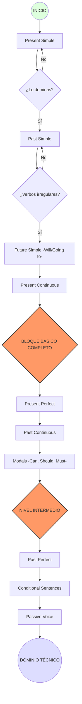

# STYLESHEET INGLES

## verbo to be 
| Pronombre | Verbo (ser/estar) |  Español |
|------------|------------|--------------|
| I | Am | Yo soy/estoy |
| you | Are | tu eres/estas |
| He, she , it | Is |el, ella, eso es/está |
| We | Are | nosotos somos/estamos |
| they | Are | Ellos son/estan |

## tiempos verbales a dominar

# partes de una frase

## adjetivos
Lista de Adjetivos Calificativos

#### 2. Adjetivos Posesivos (Possessive)
| Adjetivo (EN) | Traducción (ES) | Contexto | Uso Recomendado |
| :--- | :--- | :--- | :--- |
| **My** | Mi / Mis | Pertenencia | "My code" (Mi código). |
| **Your** | Tu / Tus / Su | Pertenencia | "Your office" (Tu oficina). |
| **His** | Su / Sus (de él) | Pertenencia | "His computer" (Su computador). |
| **Her** | Su / Sus (de ella) | Pertenencia | "Her project" (Su proyecto). |
| **Its** | Su / Sus (animal/cosa) | Pertenencia | "Its performance" (Su rendimiento). |
| **Our** | Nuestro/a | Pertenencia | "Our team" (Nuestro equipo). |
| **Their** | Su / Sus (de ellos) | Pertenencia | "Their server" (Su servidor). |

#### 3. Adjetivos Demostrativos (Demonstrative)
| Adjetivo (EN) | Traducción (ES) | Contexto | Uso Recomendado |
| :--- | :--- | :--- | :--- |
| **This** | Este / Esta | Cercanía (Singular) | Para algo que tienes a mano. |
| **That** | Ese / Aquel / Esa | Distancia (Singular) | Para algo que está lejos de ti. |
| **These** | Estos / Estas | Cercanía (Plural) | Para varios objetos cerca. |
| **Those** | Esos / Aquellos | Distancia (Plural) | Para varios objetos lejos. |

#### 4. Adjetivos Indefinidos (Indefinite)
| Adjetivo (EN) | Traducción (ES) | Contexto | Uso Recomendado |
| :--- | :--- | :--- | :--- |
| **Some** | Algún / Algunos | Afirmativo | Para una cantidad no definida. |
| **Any** | Cualquier / Ningún | Negativo/Pregunta | "Any error?" (¿Algún error?). |
| **Many** | Muchos / Muchas | Contable | Para gran cantidad de objetos. |
| **Much** | Mucho / Mucha | Incontable | Para conceptos (tiempo, dinero). |
| **Few** | Pocos / Pocas | Contable | Para una cantidad pequeña. |
| **Several** | Varios / Varias | General | Más de dos, pero no muchos. |
| **Each** | Cada | Individual | Para referirse a cada unidad por separado. |

#### 1. Adjetivos Calificativos (Qualitative)
| Adjetivo (EN) | Traducción (ES) | Contexto | Uso Recomendado |
| :--- | :--- | :--- | :--- |
| **Reliable** | Confiable | Profesional | Para alguien que cumple siempre. |
| **Sharp** | Afilado/Astuto | Intelecto | Para una mente rápida o cuchillos. |
| **Stunning** | Impresionante | Estética | Belleza que destaca mucho. |
| **Cluttered** | Desordenado | Espacios | Para una oficina con muchas cosas. |
| **Hectic** | Agitado | Tiempo | Para un día con mucho trabajo. |
| **Blunt** | Directo | Comunicación | Alguien que dice la verdad sin filtros. |

#### 4. Tiempo, Tamaño y Cantidad
| Adjetivo (EN) | Traducción (ES) | Contexto | Uso Recomendado |
| :--- | :--- | :--- | :--- |
| **Massive** | Masivo/Enorme | Tamaño | Algo de dimensiones gigantescas. |
| **Brief** | Breve | Tiempo | Reuniones o textos de corta duración. |
| **Ancient** | Antiguo | Historia | Cosas con siglos de antigüedad. |
| **Swift** | Veloz | Movimiento | Una acción que ocurre rápido. |
| **Tiny** | Diminuto | Tamaño | Algo extremadamente pequeño. |
| **Endless** | Infinito | Duración | Algo que parece no terminar nunca. |
| **Sudden** | Repentino | Eventos | Algo que ocurre sin previo aviso. |

## preposiciones 

#### preposiciones de lugar
| Preposición | Significado | Uso principal | Ejemplo (EN) | Español |
|------------|------------|--------------|-------------|--------|
| in | en / dentro de  | interior de algo | The keys are in the box | Las llaves estan en la caja | 
| on | en / sobre | superficie | the book is on the table | El libro esta sobre la mesa
| at | en /espesifico | punto específico | I am at the door | Estoy en la puerta |
| between  | entre (2) | dos elementos | Between you and me | Entre tú y yo |
| among | entre (varios) | grupo | Among friends | Entre amigos |
| under  | debajo | posición | The cat is under the table  | El gato está debajo |
| above  | encima | más alto | The lamp is above | La lámpara está arriba |
| below | debajo | nivel | Below zero | Bajo cero |
| out of | fuera de | salir | Get out of the car | Sal del auto |
| up | arriba | dirección | Go up the hill | Sube la colina |
| down | abajo | dirección | Go down the stairs | Baja las escaleras |
| off | quitar | separación | Take it off | Quítalo |
| near | cerca | proximidad | Near the house | Cerca de la casa |
| far from | lejos | distancia | Far from here | Lejos de aquí |

#### preposiciones de relacion
| Preposición | Significado | Uso principal | Ejemplo (EN) | Español |
|------------|------------|--------------|-------------|--------|
| with  | con | compañía | I go with my friend  | Voy con mi amigo |
| without  | sin | ausencia | Coffee without sugar  | Café sin azúcar |
| of  | de | relación/posesión | The color of the car  | El color del auto |
| about  | sobre | tema | We talk about music  | Hablamos sobre música |
| by  | por | autor/método | Book by him | Libro por él |
| for  | para | propósito | This is for you  | Esto es para ti |

#### preposiciones de tiempo
| Preposición | Significado | Uso principal | Ejemplo (EN) | Español |
|------------|------------|--------------|-------------|--------|
| in | en / dentro de | tiempos largos | I need to finish the documentation in December | Necesito terminar la documentación en diciembre | 
| on | en / sobre | dias epesificos y fechas | I have a networking class on Tuesdays. | tengo una clase de redes en martes
| at | en / hora espesifica | hora precisa o momentos del dia | The script starts at 12:00. | el script inicia a las 12:00 |
| before | antes | tiempo | Before dinner | Antes de cenar |
| after | después | tiempo | After work | Después del trabajo |
| during | durante | periodo | During the movie | Durante la película |
| since | desde | inicio pasado | Since 2020 | Desde 2020 |
| until | hasta | límite | Wait until tomorrow | Espera hasta mañana |
| for | por | duración | For two hours | Por dos horas |

#### preposiciones de movimiento
| Preposición | Significado | Uso principal | Ejemplo (EN) | Español |
|------------|------------|--------------|-------------|--------|
| to | a | Direccion | Go to the store | Ve a la tienda |
| from | de | Origen | I come from chile | Vengo de chile | 
| toward | hacia | trayecto | The child runs towards his mother | El niño corre hacia su madre | 
| across | cruzar | superficie | Across the street | Cruzar la calle |
| over  | sobre | movimiento/cubrir | The plane flies over | El avión vuela sobre |

#### relacion logica
| Preposición | Significado | Uso principal | Ejemplo (EN) | Español |
|------------|------------|--------------|-------------|--------|
| because of  | debido a | causa | Because of rain | Debido a la lluvia |
| according to  | según | referencia | According to him | Según él |
| instead of  | en vez de | sustitución | Instead of coffee | En vez de café |

---

# verbos
| Verbo | Significado | Uso | Ejemplo (EN) | Español |
|------|------------|-----|-------------|--------|
| work 🔨 | trabajar | acción general | I work every day | Trabajo todos los días |
| eat 🍎 | comer | alimento | She eats rice | Ella come arroz |
| play 🎮 | jugar | actividades/juegos | We play soccer | Jugamos fútbol |
| study 📚 | estudiar | aprendizaje | He studies math | Él estudia matemáticas |
| watch 📺 | ver/mirar | TV, videos | I watch movies | Veo películas |
| fix 🔧 | arreglar | reparar cosas | He fixes computers | Él arregla computadores |
| go 🚶 | ir | movimiento | She goes to school | Ella va a la escuela |
| use 🧠 | usar | herramientas/objetos | She uses a phone | Ella usa un teléfono |
| like ❤️ | gustar | preferencia | I like music | Me gusta la música |
| need 🆘 | necesitar | necesidad | He needs help | Él necesita ayuda |
| want 🎯 | querer | deseo | I want water | Quiero agua |
| know 🧠 | saber | conocimiento | She knows English | Ella sabe inglés |
| think 💭 | pensar | opinión | I think it's good | Creo que está bien |
| say 🗣️ | decir | comunicación | He says hello | Él dice hola |
| take ✋ | tomar | acción de tomar | She takes a bus | Ella toma el bus |
| see 👀 | ver | percepción | I see the car | Veo el auto |
| come 🚪 | venir | movimiento hacia | They come here | Vienen aquí |
| give 🎁 | dar | entrega | He gives gifts | Él da regalos |
| find 🔍 | encontrar | búsqueda | I find keys | Encuentro llaves |
| work out 💪 | entrenar | ejercicio | I work out daily | Entreno diariamente |
| start 🚀 | comenzar | inicio | She starts work | Ella empieza el trabajo |
| finish 🏁 | terminar | final | He finishes school | Él termina la escuela |
| open 🚪 | abrir | acción física | I open the door | Abro la puerta |
| close 🚪 | cerrar | acción física | She closes the window | Ella cierra la ventana |
| make 🏗️ | hacer/crear | producción | I make food | Hago comida |
| do ⚙️ | hacer | actividad general | I do homework | Hago tareas |
| live 🏠 | vivir | lugar de vida | They live in Santiago | Viven en Santiago |
| have 📦 | tener | posesión | I have a car | Tengo un auto |

## verbos modales
### verbos especiales que cambian la gramatica 
#### no usan to para conectar dos verbos
#### cambian su gramatica con los pronombres it,she,he

| Tipo | Verbo | Significado | Regla | Ejemplo (EN) | Español |
|------|------|------------|------|-------------|--------|
| Modal | can 💪 | poder | base + verbo | I can swim | Puedo nadar |
| Modal | could 🤔 | podría | base + verbo | I could go | Podría ir |
| Modal | should 👍 | debería | base + verbo | You should study | Deberías estudiar |
| Modal | must ⚠️ | deber | obligación | You must stop | Debes parar |
| Modal | may 🎩 | puede | permiso | You may enter | Puedes entrar |
| Modal | might 🌫️ | podría | posibilidad | It might rain | Podría llover |
| Modal | will 🔮 | futuro | decisión | I will go | Iré |
| Modal | would 💭 | condicional | hipótesis | I would help | Ayudaría |

### partes de una frase
Sustantivo (Noun) -> Nombre de las cosas
Adjetivo (adjective) -> Describe el pronombre
Pronombre (Pronoum) -> Reemplaza el nombre
Articulos (article) -> Presenta el nombre 
Verbo (verb) -> Accion o estado
Adverbio (adverb) -> Describe la accion
Preposicion (preposition) -> Une palabras, indica relacion
Conjuncion (conjunction) -> Une ideas
Interseccion (interjeccion) -> Expresa emocion
